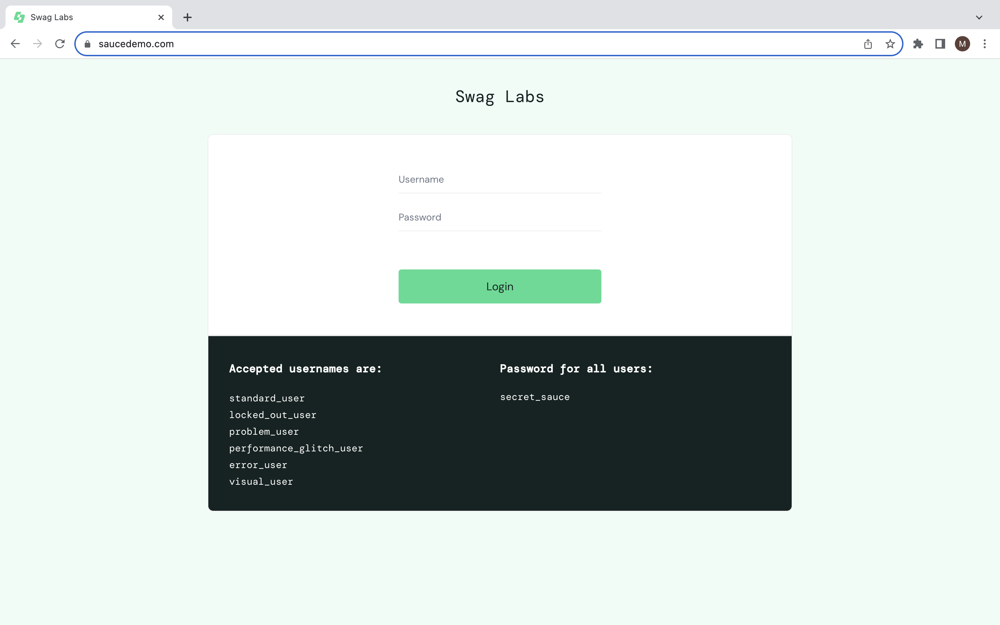

# Testing SauceDemo webpage functionality 

## Table of content
* #### <a href="#About this project">About this project</a>
* #### <a href="#Prerequisites">Prerequisites</a>
* #### <a href="#Installation">Installation</a>
* #### <a href="#Architecture">Architecture</a>
* #### <a href="#Contact">Contact</a>

## About this project

* In this project are presented automated tests to check SauceDemo website functionality. 
* Testing environment can be found <a href="https://www.saucedemo.com/">here</a>. 
* The code is written in Java language, using Selenium and Maven.
* Cucumber is used to provide more understanding on how the code works.

## Prerequisites

In order to utilise this project you need to have the following installed locally:

* Maven:
  On Windows install <a href="https://chocolatey.org/install">Chocolatey</a> and use the following command:
  <pre>choco install maven</pre>
On MacOS install <a href="https://brew.sh/">HomeBrew</a> and use the following command:
  <pre>brew install maven</pre>
* JDK (can be installed via <a href="https://docs.aws.amazon.com/corretto/latest/corretto-11-ug/downloads-list.html">Amazon Corretto</a>)
* Chrome browser
* <a href="https://git-scm.com/downloads">Git</a>

## Installation

To reproduce this project repeat the following steps:

* Clone the repository:
<pre>git clone mrudnyk/selenium-project</pre>
* Run all the tests by typing in terminal:
<pre>mvn test</pre>

## Architecture
Framework is divided in such subsections:
* src/main/java/lv/acodemy/hooks - @After annotation that provides actions after each test
* src/main/java/lv/acodemy/runner - Cucumber runner for test execution
* src/main/java/lv/acodemy/sauce_pages - Objects and methods of specific pages of website
* src/main/java/lv/acodemy/step_definitions - Step definitions
* src/main/java/lv/acodemy/utils - Test data and properties utils
* src/test/java - file with tests
* src/test/resources - file with test feature written in Gherkin language

## Contact
* Project link: <a href="https://github.com/mrudnyk/selenium-project">https://github.com/mrudnyk/selenium-project </a>
* Linkedin: <a href="https://www.linkedin.com/in/mariia-rudnyk-b86624287/">https://www.linkedin.com/in/mariia-rudnyk-b86624287/ </a>
* Personal email: <a href="mailto: mariia.rudnyk@outlook.com"> mariia.rudnyk@outlook.com </a>

